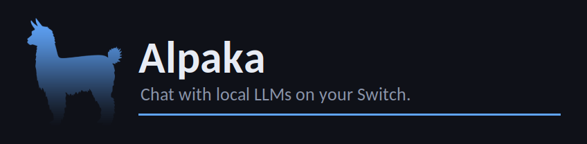

# Alpaka

Run local LLMs (GGUF models via llama.cpp) natively on a homebrew-enabled
Nintendo Switch — no internet connection required. CPU-only inference, a
custom graphical UI (no SDL2), model picker, and persistent multi-chat
history saved to the SD card.

*Disclaimer: this project's GUI was built collaboratively with Claude Sonnet 5.*



## Features

- Pick any `.gguf` model dropped into `sdmc:/switch/llm/models/`
- Multiple saved chats per model, stored as compact binary files on the SD
  card — resume, delete, or start fresh without reloading the model
- Multi-turn conversation context (not just single-shot Q&A)
- Streaming, word-wrapped chat with inline markdown rendering (`**bold**`,
  `` `code` ``, fenced code blocks)
- Fully custom software renderer — a plain libnx framebuffer with
  `stb_truetype` text, after an SDL2-based UI hit unresolved input crashes on
  real hardware
- Runs fully offline, CPU-only (Tegra X1, no GPU/CUDA support — see
  [Background](#background))

## Requirements

- A Switch with Atmosphère (or compatible) CFW and the homebrew launcher
- devkitPro with `devkitA64`, `switch-dev`, and `switch-tools` installed
- A quantized `.gguf` model (see [Getting a model](#getting-a-model))

## Building

### 1. Install devkitPro (if you haven't already)

```sh
wget https://apt.devkitpro.org/install-devkitpro-pacman
chmod +x ./install-devkitpro-pacman
sudo ./install-devkitpro-pacman
sudo dkp-pacman -S devkitA64 switch-dev switch-tools
```

Make sure your environment has:

```sh
export DEVKITPRO=/opt/devkitpro
export DEVKITA64=${DEVKITPRO}/devkitA64
export PATH=${DEVKITPRO}/tools/bin:${DEVKITA64}/bin:${PATH}
```

### 2. Clone llama.cpp

```sh
git clone https://github.com/ggml-org/llama.cpp
```


### 3. Cross-compile llama.cpp for the Switch

```sh
mkdir build-switch && cd build-switch
cmake .. -DCMAKE_TOOLCHAIN_FILE=../switch-toolchain.cmake \
  -DGGML_OPENMP=OFF \
  -DGGML_NATIVE=OFF \
  -DLLAMA_CURL=OFF \
  -DBUILD_SHARED_LIBS=OFF \
  -DCMAKE_BUILD_TYPE=Release \
  -DLLAMA_BUILD_TOOLS=OFF \
  -DLLAMA_BUILD_EXAMPLES=OFF \
  -DLLAMA_BUILD_SERVER=OFF \
  -DLLAMA_BUILD_TESTS=OFF \
  -DLLAMA_BUILD_APP=OFF \
  -DGGML_BACKEND_DL=OFF \
  -DGGML_CPU=ON \
  -DLLAMA_BUILD_COMMON=OFF
make -j$(nproc)
cd ../..
```

The toolchain file (`switch-toolchain.cmake`) is included in this repo —
copy it into your llama.cpp checkout before running `cmake`:

```sh
cp switch-toolchain.cmake llama.cpp/
```

### 4. Build Alpaka

Edit the `LLAMA_DIR` variable near the top of the `Makefile` if your
llama.cpp checkout isn't at `~/llama.cpp`, then:

```sh
export DEVKITPRO=/opt/devkitpro
make -j$(nproc)
```

This produces `alpaka.nro`.

## Installing on your Switch

Copy the following to your SD card:

```
sdmc:/switch/alpaka.nro
sdmc:/switch/llm/models/<your-model>.gguf
```

`sdmc:/switch/llm/chats/` is created automatically the first time you open a
model's chat list.

## Getting a model

Any GGUF model works in principle, but stick to small, heavily quantized
(Q4) models — the Switch has 4 GB of RAM total and homebrew gets a fraction
of that. Known-good starting points:

- **Qwen2.5-0.5B-Instruct** (Q4_K_M) — ~380 MB, fastest, least coherent
- **Gemma-2-2B-it** (Q4_K_M) — ~1.6 GB, noticeably better quality, needs the
  heap-reserve bump already set in the Makefile

Drop the `.gguf` file into `sdmc:/switch/llm/models/`.

## Controls

| Screen | Button | Action |
|---|---|---|
| Model picker | A | Open chat list for the selected model |
| | Y | Rescan the models folder |
| | L / R | Page up / down |
| Chat list | A | Open selected chat, or start a new one |
| | Y | Delete selected chat (press again to confirm) |
| | B | Back to model picker |
| Chat | A | Write a message (opens the system keyboard) |
| | B | Stop generation, or go back (model stays loaded) |
| | X | Start a new chat |
| | D-Pad / right stick | Scroll |
| | ZL / ZR | Jump to top / jump to latest |
| Any screen | − | Toggle debug overlay |
| | + | Quit |

## Background

This started as an experiment to see whether a Tegra X1 (Switch's SoC, same
chip as the Jetson TX1) could run LLM inference at all under homebrew. Short
version: yes, CPU-only, no CUDA (Nintendo never shipped the proprietary
Nvidia CUDA driver stack on Horizon OS). GPU compute needs a from-scratch
Vulkan/deko3d compute backend for ggml — a custom `ggml-deko3d` backend is in
progress and has been validated in isolated hardware tests, but it isn't
wired into this app yet.

Expect roughly 1–3 tokens/second depending on model size and quantization —
confirmed to be a Tegra X1 memory-bandwidth limit, not a GUI/rendering
bottleneck (frame rate holds at 59–60 FPS during generation). This is a fun
toy, not a production inference stack. Even tho it is quite powerful!

## Known limitations

- No GPU acceleration yet (see [Background](#background))
- Conversation history is re-fed to the model on every turn (no incremental
  KV-cache reuse across turns), so long chats get slower and can eventually
  exceed the context window
- Markdown: no headers, lists, horizontal rules, or italics (would need
  per-line font sizing, or a slanted font that isn't available on-device)

## Contributing

PRs welcome, especially around:

- GPU acceleration (wiring up `ggml-deko3d`)
- Incremental KV-cache reuse for long conversations
- Chat management (rename)
- Markdown headers/lists/horizontal rules in the chat view
- Testing on Switch V1 vs Mariko/V2 hardware

## Credits

- [llama.cpp](https://github.com/ggml-org/llama.cpp) / ggml — inference engine
- [libnx](https://github.com/switchbrew/libnx) / devkitPro — Switch homebrew toolchain
- [stb_truetype](https://github.com/nothings/stb) — font rasterization
- [Atmosphère](https://github.com/Atmosphere-NX/Atmosphere) + [Sphaira](https://github.com/ITotalJustice/sphaira) — CFW and homebrew launching used during development

## License

MIT for the code in this repo, see [LICENSE](LICENSE). llama.cpp itself is
MIT-licensed.
